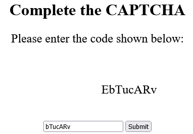
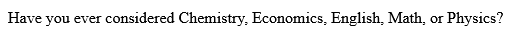

# <b>Project One: Interactive History Sniffing: CAPTCHA </b> 

<ins><b>Description</ins></b> 
In this CAPTCHA program, certain letters are associated with a specific link. If the user has recently visited one of these linked pages, the corresponding letter will vanish from the CAPTCHA. Consequently, the user will be recommended majors based on the remaining links that haven't been visited. This mechanism ensures that the CAPTCHA dynamically adjusts to the user's browsing history, offering personalized recommendations tailored to their interests and activities.

## Demo
Here are screenshots demonstrating the program in action: 

This example demonstrates the user's view of the program. In this scenario, the first "E" in the CAPTCHA is intentionally left out, which is linked to the Art History page. If the user had visited the Art History page recently before visiting this CAPTCHA page, the "E" would not appear for the user. Consequently, the program will print out the majors associated with the remaining links that the user hasn't visited.

<ins><b> Code Implementation: </ins></b> 
[Python Code](history.py): The main Python script for detecting web history and generating recommendations.  
[HTML Code](question.tpl): The HTML template file used by the program.

<ins><b>Features</ins></b>
- User Verification System
- Website History Detection
- Personalized Recommendations

<ins><b>Technologies Used</ins></b>

- Virtual Machine 
- HTML & Python
- Web Framework

[Click here](https://github.com/Geremyycx/Signature-Work-Portfolio.git) to return to the main portfolio page.

